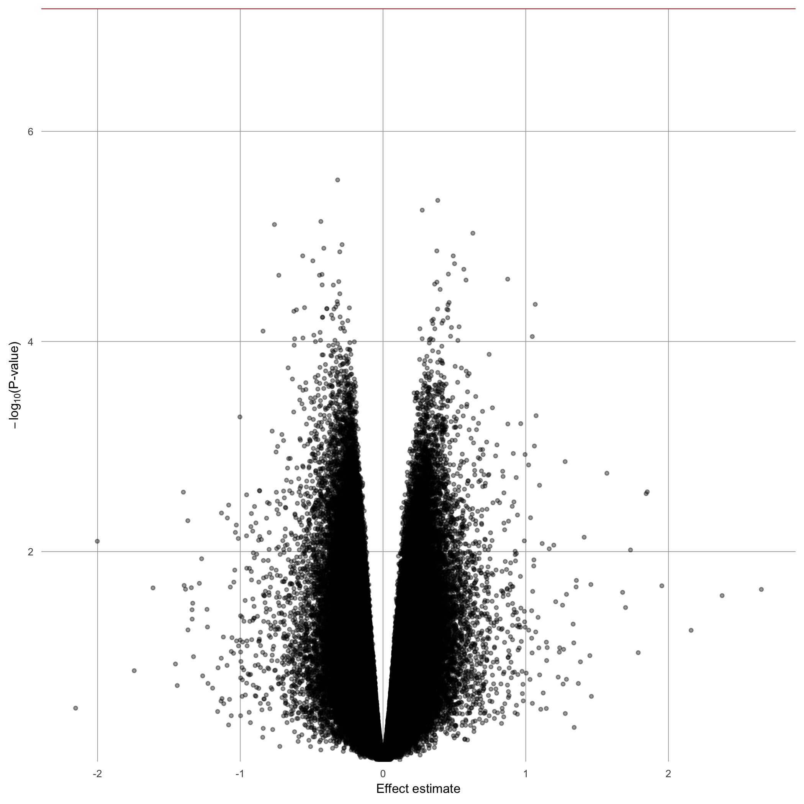

## Required Packages

```{r library, warning=FALSE, message=FALSE}
library(tidyverse)
library(minfi)
library(limma)
library(IlluminaHumanMethylationEPICanno.ilm10b4.hg19)
library(minfi)
library(DMRcate)

# call helpers
source("../../helper-scripts/DMP-utility-functions.R")
source("../../helper-scripts/plotting-functions.R")
source("../../helper-scripts/probe-annotation.R")
source("../../helper-scripts/shared-helpers.R")

# knitr settings
knitr::opts_chunk$set(echo = TRUE, warning = FALSE, message = FALSE)
```

## Load Data

```{r load-data}
# Load Data
load(
  "../../../arsenic-epigenetics-meta/Chile/pbmcs/data/pbmcs_funnorm_data.RData"
)

pheno <- as.data.frame(pheno)

# load cell counts
load(
  file = "../../../arsenic-epigenetics-meta/Chile/pbmcs/data/cell_counts_pbmcs.RData"
)
```

## Exposure Counts

```{r exposure-dist-plot}
# Look at exposure distribution
exp_dist_p <- ggplot(pheno, aes(exposed)) +
  geom_histogram(alpha = 0.7, stat = "count", binwidth = 50) +
  xlab("Exposed?") +
  ylab("Count") +
  ggtitle("Distribution of Arsenic Exposure") +
  theme_minimal()

ggsave(filename = "DMP-plots/arsenic-exp-dist.png", device = "png", dpi = 300)
```
```{r, out.width = '100%'}
exp_dist_p
```


## Fit Models

There aren't any significant results after adjusting for multiple testing.

```{r fit-models, eval=FALSE}
# combine pheno with cell counts
pheno <- cbind(pheno, cell_counts$counts)

# Unadjusted model matrix
modUnadj <- model.matrix(~pheno$exposed)
                 
# Adjusted for cell type
modCell <- model.matrix(~pheno$exposed + pheno$CD8T + pheno$CD4T +
                        pheno$NK + pheno$Bcell + pheno$Mono + pheno$Gran)
                   
# Adjusted for age, smoking, and sex
modAgeSMSex <- model.matrix(~pheno$exposed + pheno$age + pheno$smoking +
                            pheno$sex)

# Adjusted for age, smoking, sex, anc cell composition
modCellAgeSMSex <- model.matrix(~pheno$exposed + pheno$age + pheno$smoking +
                                pheno$sex + pheno$CD8T + pheno$CD4T + pheno$NK +
                                pheno$Bcell + pheno$Mono + pheno$Gran)

# Unadjusted
probeUnadj <- run_DMP(mvals = mvals_fun, design = modUnadj)

# no singificant CpG sites with BH correction
table(probeUnadj$P.Value < 0.05)
table(probeUnadj$adj.P.Val < 0.05)

# write sites with singificant raw p-values
write.table(
  probeUnadj,
  file = "DMP-results/unadjusted.txt",
  sep = "\t",
  row.names = FALSE,
  col.names = TRUE
)

# plot results
gg_qqplot(probeUnadj$P.Value)
quartz.save("DMP-plots/qq_log_unadjusted.png", type = "png", dpi = 300)

volcano(probeUnadj)
quartz.save("DMP-plots/vol_log_unadjusted.png", type = "png", dpi = 300)

manhattan(probeUnadj, Locations)
quartz.save("DMP-plots/man_log_unadjusted.png", type = "png", dpi = 300)


# Adjusted for cell type
probeCell <- run_DMP(mvals = mvals_fun, design = modCell)

# no singificant CpG sites with BH correction
table(probeCell$P.Value < 0.05)
table(probeCell$adj.P.Val < 0.05)

# save the results
write.table(
  probeCell,
  file = "DMP-results/cell.txt",
  sep = "\t",
  row.names = FALSE,
  col.names = TRUE
)

# save the results
gg_qqplot(probeCell$P.Value)
quartz.save("DMP-plots/qq_log_cell.png", type = "png", dpi = 300)

volcano(probeCell)
quartz.save("DMP-plots/vol_log_cell.png", type = "png", dpi = 300)

manhattan(probeCell, Locations)
quartz.save("DMP-plots/man_log_cell.png", type = "png", dpi = 300)


# Adjusted for age, smoking, and sex
probeAgeSmSex <- run_DMP(mvals = mvals_fun, design = modAgeSMSex)
   
# no singificant CpG sites with BH correction
table(probeAgeSmSex$P.Value < 0.05)
table(probeAgeSmSex$adj.P.Val < 0.05)

# save the results
write.table(
  probeAgeSmSex,
  file = "DMP-results/age-sex-smoking.txt",
  sep = "\t",
  row.names = FALSE,
  col.names = TRUE
)

# plot results
gg_qqplot(probeAgeSmSex$P.Value)
quartz.save("DMP-plots/qq_log_sex-age-smoking.png", type = "png", dpi = 300)

volcano(probeAgeSmSex)
quartz.save("DMP-plots/vol_log_sex-age-smoking.png", type = "png", dpi = 300)

manhattan(probeAgeSmSex, Locations)
quartz.save("DMP-plots/man_log_sex-age-smoking.png", type = "png", dpi = 300)


# Adjusted for cell type, age, smoking, and sex
probeCellAgeSmSex <- run_DMP(mvals = mvals_fun, design = modCellAgeSMSex)
   
# no singificant CpG sites with BH correction
table(probeCellAgeSmSex$P.Value < 0.05)
table(probeCellAgeSmSex$adj.P.Val < 0.05)

# save the results
write.table(
  probeCellAgeSmSex,
  file = "DMP-results/cell-age-sex-smoking.txt",
  sep = "\t",
  row.names = FALSE,
  col.names = TRUE
)

# plot results
gg_qqplot(probeCellAgeSmSex$P.Value)
quartz.save("DMP-plots/qq_log_cell-sex-age-smoking.png", type = "png",
            dpi = 300)

volcano(probeCellAgeSmSex)
quartz.save("DMP-plots/vol_log_cell-sex-age-smoking.png", type = "png",
            dpi = 300)

manhattan(probeCellAgeSmSex, Locations)
quartz.save("DMP-plots/man_log_cell-sex-age-smoking.png", type = "png",
            dpi = 300)
```


## QQ Plot -- Unadjusted

```{r qqplotu, out.width='100%'}

```

## Volcano Plot -- Unadjusted

```{r vplotu, out.width='100%'}

```

## Manhattan Plot -- Unadjusted

```{r mplotu, out.width='100%'}

```


## QQ Plot -- Exposure Adjusted for Age, Sex, and Smoking Status

```{r qqplot_no-cell, out.width='100%'}

```

## Volcano Plot -- Exposure Adjusted for Age, Sex, and Smoking Status

```{r vplot_no-cell, out.width='100%'}

```

## Manhattan Plot -- Exposure Adjusted for Age, Sex, and Smoking Status

```{r mplot_no-cell, out.width='100%'}

```

## QQ Plot -- Exposure Adjusted for Age, Cells, Sex, and Smoking Status

```{r qqplotall, out.width='100%'}

```

## Volcano Plot -- Exposure Adjusted for Age, Cells, Sex, and Smoking Status

```{r vplotall, out.width='100%'}

```

## Manhattan Plot -- Exposure Adjusted for Age, Cells, Sex, and Smoking Status

```{r mplotall, out.width='100%'}

```
