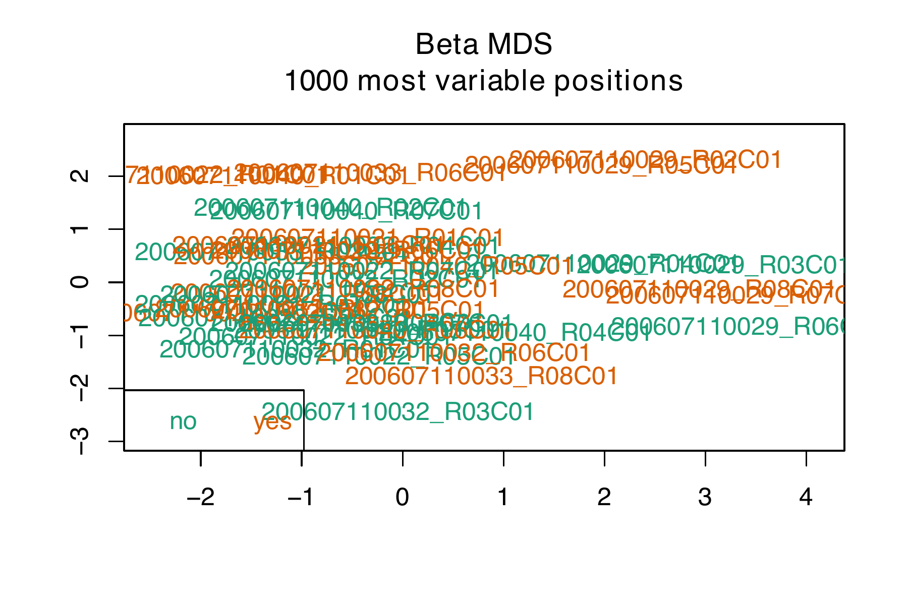

## Required Packages

```{r library, message=FALSE, warning=FALSE}
library(tidyverse)
library(RColorBrewer)
library(readxl)
library(minfi)
library(ggplot2)
library(ENmix)
library(stringr)
library(geneplotter)
library(ChAMP)
library(wateRmelon)
library(sva)
library(pdftools)
library(filesstrings)
library(Harman)
library(DMRcate)

knitr::opts_chunk$set(echo = FALSE, warning = FALSE, message = FALSE)
```

## Load Data

First, we load the PBMCs sample metadata. Note that the orignal
sample metadata had a number of errors: there was a duplication of sample IDs.

```{r load-data, eval=FALSE, echo=TRUE}
# Get the sample info. Note that the top-level file for this R project is a
# clone of the "Superfund-Methylatio" GitHub repository. The data is stored in a
# copy of the "Arsenic Epigeenetics META" repository, locally named
# "arsenic-epigenetics-meta".
sample_metadata <- read_xlsx(
  path = paste0(
    "../../../arsenic-epigenetics-meta/Chile/20170212_AC2013_DNAmethArray_Buccal",
    "_PBMCs_MetaData.xlsx"),
  sheet = "AC2013_DNAmeth_PL1_PBMCs"
) %>%
  mutate(
    position = `Position (on FINAL PLATE)`,
    sample_id = `Sample ID`,
    pbmc_sample_id = `PBMC ID`,
    study_id = `Study_ID...5`,
    exposed = as.factor(if_else(`Exposed: Yes:1; No:2` == 1, "yes", "no")),
    age = P3Q8_Age,
    sex = as.factor(if_else(`P3Q9_Sex_(M=1,F=2)` == 1, "M", "F")),
    smoking = as.factor(if_else(P38Q96_Smoking == 1, "yes", "no")),
    secondhand_smoking = as.factor(
      if_else(P40Q116_Smoking_Secondhand_for_non_smokers == "1", "yes", "no")
    ),
    diabetes = as.factor(if_else(P11Q35_Diabetes == 1, "yes", "no")),
    skin_cancer = as.factor(if_else(P10Q33_Cancer_Skin == 1, "yes", "no")),
    hypertension = as.factor(if_else(P12Q37_Hypertension == 1, "yes", "no")),
    cardio = as.factor(if_else(P13Q38_Cardio == 1, "yes", "no")),
    breastfed = as.factor(if_else(P26Q63_Breastfed == "1", "yes", "no")),
    gastric = as.factor(if_else(P16Q43_Gastric == 1, "yes", "no")),
    tuberculosis = as.factor(if_else(P15Q42_Tuberculosis == 1, "yes", "no")),
    intestinal = as.factor(if_else(P17Q45_Intestinal == 1, "yes", "no")),
    childhood_diseases = as.factor(
      if_else(P20Q50_Childhood_diseases == 1, "yes", "no")
    ),
    anemia = as.factor(if_else(P18Q47_Anemia == 1, "yes", "no")),
    immune = as.factor(if_else(P19Q48_Immune == 1, "yes", "no")),
    antibiotics = as.factor(
      if_else(`P22Q54_Antibiotics_(Yes=1,No=2)` == 1, "yes", "no")
    ),
    immunosuppresor = as.factor(
      if_else(`P24Q58_Immuosupresores_(Yes=1,No=2)` == 1, "yes", "no")
    ),
    laxatives = as.factor(
      if_else(`P25Q62_laxatives_(Yes=1,No=2)` == 1, "yes", "no")
    ),
    med_high_triglycerides = as.factor(
      if_else(Med_High_triglycerides == 1, "yes", "no")
    ),
    med_insulin_resistance = as.factor(
      if_else(Med_Insulin_resistance == 1, "yes", "no")
    ),
    med_hypertension = as.factor(if_else(Med_Hypertension == 1, "yes", "no")),
    med_diabetes = as.factor(if_else(Med_Diabetes == 1, "yes", "no")),
    med_high_cholesterol = as.factor(
      if_else(Med_High_Cholesterol == 1, "yes", "no")
    ),
    med_anticoagulant = as.factor(if_else(Med_anticoagulant == 1, "yes", "no")),
    weight_20 = P4Q12a_Weight20,
    weight_40 = P4Q12b_Weight40
  ) %>%
  dplyr::select(
    position, sample_id, pbmc_sample_id, study_id, exposed, age, sex, smoking,
    secondhand_smoking, diabetes, skin_cancer, hypertension, cardio, breastfed,
    gastric, tuberculosis, intestinal, childhood_diseases, anemia, immune,
    antibiotics, immunosuppresor, laxatives, med_high_triglycerides,
    med_insulin_resistance, med_hypertension, med_diabetes,
    med_high_cholesterol, med_anticoagulant, weight_20, weight_40
  ) %>%
  filter(
    sample_id != "QC", pbmc_sample_id != "BLANK"
  )

# assign duplicates
sample_metadata <- sample_metadata %>%
  mutate(
    duplicates = if_else(sample_id %in% c("P17", "P29"), 1,
                   if_else(sample_id %in% c("P3", "P46"), 2,
                     if_else(sample_id %in% c("P5", "P10"), 3,
                       if_else(sample_id %in% c("P4", "P15"), 4, 0))))
  )

# now load the sentrix id and position data
sample_info <- read_csv(
  "../../../arsenic-epigenetics-meta/Chile/Sample_Info-Berkeley.csv"
) %>%
  dplyr::select(
    Sample.ID, Sample_Well, Sentrix_ID, Sentrix_Position
  ) %>%
  mutate(
    sentrix_full = paste(Sentrix_ID, Sentrix_Position, sep = "_"),
    sample_id = Sample.ID,
    position = Sample_Well
  ) %>%
  dplyr::select(
    sample_id, position, sentrix_full
  ) %>%
  filter(
    sample_id %in% paste0("P", 1:47)
  )
 
# create a vector of idat filenames
sample_info$Basename <- paste0(
  paste0("/Users/philippe/Documents/berkeley/",
         "superfund/arsenic-epigenetics-meta/Chile/idat/"),
  sample_info$sentrix_full
)

# include the base idat filenames to the sample metadata
sample_info <- sample_info %>%
  dplyr::select(position, Basename)
sample_metadata <- sample_metadata %>%
  left_join(sample_info, by = "position")
```

With the meta data completed, we now remove the duplicates from the data,
retaining only the first sample in order of sample ID from each individual. The 
duplicated samples are listed below:

- Participant AC130010: P17 and P29
- Participant AC130031: P3 and P46
- Participant AC130048: P5 and P10
- Participant AC130084: P4 and P15

```{r rm-duplicates, echo=TRUE, eval=FALSE}
keep <- !(sample_metadata$sample_id %in% c("P17", "P3", "P5", "P4"))
sample_metadata <- sample_metadata[keep, ]
rm(sample_info, keep)
```


### Create `RGChannelSetExtended` Object

Next, we create or load the `RGChannelSetExtended` object, depending on whether
or not it's been generated locally in the past.

```{r RGset, eval=FALSE}
# Change to eval = TRUE if RGset dataset does not exist in the environment. Plug
# in sample metadata generated from the previous code chunk.
RGset <- read.metharray.exp(targets = sample_metadata, extended = TRUE)
save(
  RGset,
  file = "../../../arsenic-epigenetics-meta/Chile/pbmcs/data/pmbcs_RGset.RData"
)
```


```{r pheno, echo=TRUE, cache=TRUE}
# if the RGset already exists, run this code chunk instead of the one above
load("../../../arsenic-epigenetics-meta/Chile/pbmcs/data/pmbcs_RGset.RData")
pheno <- pData(RGset)
sample_name <- rownames(pheno)
pheno <- data.frame(pheno, sample_name)

# adding Sentrix ID for subsequent batch correction in downstream analysis
sentrix_id <- as.factor(
  stringr::str_extract_all(pheno$sample_name, "^([0-9]{12})",
                           simplify = TRUE)
)
pheno <- data.frame(pheno, sentrix_id)

# remove features without any variation
pheno <- pheno[, apply(pheno, 2, function(x) length(unique(x)) > 1)]
```

## Internal Quality Control

First, we check that the signal to noise ratio of each sample. The average
detection p-value of the samples are very low, and so no samples are removed at
this stage.

```{r detection_p-values, cache=TRUE, echo=TRUE}
# check detection p-values
det_p <- detectionP(RGset)
pal <- brewer.pal(8, "Dark2")
barplot(
  colMeans(det_p), col = pal[factor(pheno$sample_id)], las = 2,
  cex.names = 0.8, ylab = "Mean detection p-values",
  names.arg = pheno$sample_id
)
```

We then produce a PDF version QC report for Illumina Infinium Human Methylation
450k arrays, which is useful for identifying failed samples.

```{r internal-control, eval=FALSE}
qcReport(
  RGset,
  sampGroups = pheno$exposed,
  pdf = "preprocessing-reports/buccal_ControlProbes.pdf"
)
```

## Outlier information

### Pre-Filtering

A number of functions are run sequentially on the `RGset` object. First,
outliers are identified based on their median unmethylated/methylated intensity.

```{r outlier-information, cache=TRUE, include=FALSE, echo=TRUE}
Mset <- preprocessRaw(RGset)
QC_minfi <- minfiQC(Mset, fixOutliers = TRUE)
```

```{r save-outlier-plot, eval=FALSE}
pdf(file = "preprocessing-reports/buccal_PotentialOutliers.pdf")
plotQC(QC_minfi$qc)
dev.off()
```

```{r outlierplot, out.width='100%'}
plotQC(QC_minfi$qc)
```

Next, `champ.QC` is used to perform a brief exploratory data analysis. The
resulting plots are listed below.

```{r prefiltering-eda, eval=FALSE, echo=TRUE}
# Create pdf of quality control plots: mdsplot, densityPlot, dendrogram, et.c
champ.QC(
  beta = getBeta(Mset), pheno = pheno$exposed, mdsPlot = TRUE,
  densityPlot = TRUE, dendrogram = TRUE, PDFplot = TRUE, Rplot = FALSE,
  Feature.sel = "None", resultsDir = "preprocessing-reports/QC_preFiltering"
)
```
```{r, eval=FALSE}
#  convert pdfs to pngs for printing
pdf_convert(
  pdf = "preprocessing-reports/QC_preFiltering/raw_densityPlot.pdf",
  format = "png",
  dpi = 300,
  filenames = "preprocessing-reports/QC_preFiltering/raw_densityPlot.png"
)
pdf_convert(
  pdf = "preprocessing-reports/QC_preFiltering/raw_mdsPlot.pdf",
  format = "png",
  dpi = 300,
  filenames = "preprocessing-reports/QC_preFiltering/raw_mdsPlot.png"
)
pdf_convert(
  pdf = "preprocessing-reports/QC_preFiltering/raw_SampleCluster.pdf",
  format = "png",
  dpi = 300,
  filenames = "preprocessing-reports/QC_preFiltering/raw_SampleClustert.png"
)
```

Pre-Filtering Beta Values

```{r prebeta, out.width='100%'}

```

Pre-Filtering MDS Plot

```{r premds, out.width='100%'}

```

Pre-Filtering Dendogram

```{r predendo, out.width='100%'}

```

Pre-Filtering SVD

```{r preSVD, eval=FALSE, echo=TRUE}
# remove uninteresting variables from SVD
rm_svd <- c("position", "sample_id", "buccal_sample_id", "study_id",
            "duplicates", "Basename", "filenames", "sample_name", "sentrix_id",
            "xMed", "yMed", "predictedSex")

# run SVD
champ.SVD(
  beta = getBeta(Mset)[complete.cases(getBeta(Mset)), ],
  pd = pheno[, -which(colnames(pheno) %in% rm_svd)],
  RGEffect = TRUE, Rplot = FALSE,
  resultsDir = "preprocessing-reports/QC_preFiltering/"
)
```
```{r, eval=FALSE}
# save the plots
pdf_convert(
  pdf = "preprocessing-reports/QC_preFiltering/SVDsummary.pdf",
  format = "png",
  dpi = 300,
  filenames = c("preprocessing-reports/QC_preFiltering/raw_svd_loadings.png",
                "preprocessing-reports/QC_preFiltering/raw_screeplot.png")
)
```

```{r presvd, out.width='100%'}


```

## Post Filtering

Finally, quantitiative measures of data quality are computed, including
number of beads, averaged bisulfite conversion intensity, and detection
p-values of probes. Low quality samples and probes are identified, as well as
the outliers based on total intensity and beta value distributions. The results
are listed below. We also remove cross-reactive probes and probes within SNPs
with minor allele frequencies below 5%.

```{r qc-outlier-detection, cache=TRUE, echo=TRUE}
# compute QC metrics
qc <- ENmix::QCinfo(RGset, distplot = FALSE)
```
```{r}
# move generated plots to appropriate directory
file.move(
  "qc_CpG.jpg",
  "preprocessing-reports/QC_preFiltering/",
  overwrite = TRUE
)
file.move(
  "qc_sample.jpg",
  "preprocessing-reports/QC_preFiltering/",
  overwrite = TRUE
)
```

```{r qc-filter-samples-and-probes, echo=TRUE}
# beta: percentage of metylation
# M: log2 ratio of intensities of methylated vs. unmethylated
betas <- rmSNPandCH(
  getBeta(Mset), dist = 2, mafcut = 0.05, and = TRUE, rmcrosshyb = TRUE,
  rmXY = FALSE
)
mvals <- beta2m(betas)

# removing filtered probes from qc
qc$nbead <- qc$nbead[rownames(qc$nbead) %in% rownames(betas), ]
qc$detP <- qc$detP[rownames(qc$detP) %in% rownames(betas), ]

filtered <- champ.filter(
  beta = betas, M = mvals,
  pd = pheno, beadcount = qc$nbead, detP = qc$detP,
  arraytype = "EPIC", filterXY = TRUE, SampleCutoff = 0.05
)
```

We next perform the same exploratory data analysis as before, but with the
low-quality probes removed.

```{r filter-samples-and-probes, echo=TRUE, eval=FALSE}
# filter sample and probes
pheno <- filtered$pd
betas <- filtered$beta
mvals <- filtered$M

filtered_CpG <- rownames(betas)
unfiltered_CpG <- rownames(getBeta(Mset))
outCpG <- unfiltered_CpG[!(unfiltered_CpG %in% filtered_CpG)]
  
# recompute the density plots
champ.QC(
  beta = betas, pheno = pheno$exposed, mdsPlot = TRUE,
  densityPlot = TRUE, dendrogram = TRUE, PDFplot = TRUE, Rplot = FALSE,
  Feature.sel = "None",
  resultsDir = "preprocessing-reports/QC_postFiltering"
)

# save the csv
write.csv(
  pheno,
  file = "../../arsenic-epigenetics-meta/Chile/pbmcs/data/pbmcs_pheno.csv"
)
```
```{r, eval=FALSE}
#  convert pdfs to pngs for printing
pdf_convert(
  pdf = "preprocessing-reports/QC_postFiltering/raw_densityPlot.pdf",
  format = "png",
  dpi = 300,
  filenames = "preprocessing-reports/QC_postFiltering/raw_densityPlot.png"
)
pdf_convert(
  pdf = "preprocessing-reports/QC_postFiltering/raw_mdsPlot.pdf",
  format = "png",
  dpi = 300,
  filenames = "preprocessing-reports/QC_postFiltering/raw_mdsPlot.png"
)
pdf_convert(
  pdf = "preprocessing-reports/QC_postFiltering/raw_SampleCluster.pdf",
  format = "png",
  dpi = 300,
  filenames = "preprocessing-reports/QC_postFiltering/raw_SampleClustert.png"
)
```

Post-Filtering Beta Values

```{r post-beta, out.width='100%'}

```

Post-Filtering MDS Plot

```{r post-mds, out.width='100%'}

```

Post-Filtering Dendogram

```{r post-dendo, out.width='100%'}

```

Post-Filtering SVD

```{r post-SVD, eval=FALSE, echo=TRUE}
# run SVD
champ.SVD(
  beta = betas,
  pd = pheno[, -which(colnames(pheno) %in% rm_svd)],
  RGEffect = TRUE, Rplot = FALSE,
  resultsDir = "preprocessing-reports/QC_postFiltering/"
)
```
```{r, eval=FALSE}
# save the plots
pdf_convert(
  pdf = "preprocessing-reports/QC_postFiltering/SVDsummary.pdf",
  format = "png",
  dpi = 300,
  filenames = c("preprocessing-reports/QC_postFiltering/raw_svd_loadings.png",
                "preprocessing-reports/QC_postFiltering/raw_screeplot.png")
)
```

```{r post-svd-plots, out.width='100%'}


```


## Estimate Cell Counts

We now estimate the cell-type decomposition of each sample, and plot their
distributions.

```{r cell, eval=FALSE, echo=TRUE}
# minfi requires 450k for cell composition proportions
pbmc_450k <- convertArray(read.metharray(pheno$Basename),
                            outType = "IlluminaHumanMethylation450k")

# make the plot depicting the average DNA methylation across the cell-type
# discrimating probes in both the provided and sorted data.
# The means from the provided heterogeneous samples should be within the
# range of the sorted samples.
# If the sample means fall outside the range of the sorted means,
# the cell type estimates will inflated to the closest cell type.

# which cell type?
pdf(file = "preprocessing-reports/pbmcs_meanCellCount.pdf")
estimateCellCounts(
  pbmc_450k, compositeCellType = "Blood",
  referencePlatform = "IlluminaHumanMethylation450k", returnAll = FALSE,
  meanPlot = TRUE, verbose = FALSE)
dev.off()
   
# save the composition estimates across all samples and cell types.
# returnAll = TRUE, quantile normalize the sorted data with the provided data
# to reduce these batch effects and return a GenomicMethylSet.
cell_counts <- estimateCellCounts(
  pbmc_450k, compositeCellType = "Blood",
  referencePlatform = "IlluminaHumanMethylation450k", returnAll = TRUE,
  meanPlot = FALSE, verbose = TRUE
)
```
```{r, eval=FALSE}
write.csv(
  cell_counts$counts, file = "preprocessing-reports/cellcounts_pbmcs.csv",
  row.names = TRUE
)
save(
  cell_counts,
  file = "../../arsenic-epigenetics-meta/Chile/pbmcs/data/cell_counts_pbmcs.RData"
)
```

### Analyze Cell Counts

```{r analyze-counts, eval=TRUE, echo=TRUE}
cell_counts <- read.csv("preprocessing-reports/cellcounts_pbmcs.csv",
                        row.names = 1)
boxplot(
  cell_counts * 100, col = seq_len(ncol(cell_counts)),
  xlab = "Cell type", ylab = "Estimated %", main = "Cell type distribution"
)
```

```{r smoking-association}
# create dataframe merging smoking status and cell type decomp
pheno <- pData(RGset)
meltData <- melt(cbind(cell_counts * 100, pheno$smoking))

names(meltData)[1:3] <- c("Smoking", "Celltype", "Proportion")

boxplot(
  Proportion ~ Smoking + Celltype, data = meltData, col = c("blue", "red"),
  xaxt = "n", main = "Cell type distribution by smoking status"
)
axis(1, at = seq(from = 1.5, to = 11.5, by = 2), adj = 1,
     labels = c(colnames(cell_counts)))
legend("topleft", c("Non-smoker", "Smoker"), pch = 15,
       bty = "n", col = c("blue", "red"), cex = 1.3)
```


## Normalization

We now normalize the data, and re-perform the exploratory data analysis to
validate that the quality control measures were successful.

### Funnorm Normalization

```{r fun-normalization, eval=FALSE, echo = TRUE}
funnorm <- preprocessFunnorm(RGset)
betas_fun <- minfi::getBeta(funnorm)
betas_fun <- betas_fun[rownames(betas_fun) %in% rownames(filtered$beta), ]
newBetas <- Harman::shiftBetas(betas_fun, shiftBy = 1e-4)
mvals_fun <- B2M(betas_fun)
pheno <- pData(funnorm)

# save the processed beta and mvals, as well as pheno data
save(
  betas_fun, mvals_fun, pheno,
  file = "../../../arsenic-epigenetics-meta/Chile/pbmcs/data/pbmcs_funnorm_data.RData"
)
```
```{r post-filter-norm-eda, eval=FALSE, echo=TRUE}
# perform EDA
champ.QC(
  beta = betas_fun, pheno = pheno$exposed, mdsPlot = TRUE, densityPlot = TRUE,
  dendrogram = TRUE, PDFplot = TRUE, Rplot = FALSE, Feature.sel = "None",
  resultsDir = "preprocessing-reports/QC_postNormalization/"
)

champ.SVD(
  beta = betas_fun, pd = pheno[, -which(colnames(pheno) %in% rm_svd)],
  RGEffect = TRUE, Rplot = FALSE,
  resultsDir = "preprocessing-reports/QC_postNormalization/"
)
```
```{r, eval=FALSE}
#  convert pdfs to pngs for printing
pdf_convert(
  pdf = "preprocessing-reports/QC_postNormalization/raw_densityPlot.pdf",
  format = "png",
  dpi = 300,
  filenames = "preprocessing-reports/QC_postNormalization/raw_densityPlot.png"
)
pdf_convert(
  pdf = "preprocessing-reports/QC_postNormalization/raw_mdsPlot.pdf",
  format = "png",
  dpi = 300,
  filenames = "preprocessing-reports/QC_postNormalization/raw_mdsPlot.png"
)
pdf_convert(
  pdf = "preprocessing-reports/QC_postNormalization/raw_SampleCluster.pdf",
  format = "png",
  dpi = 300,
  filenames = "preprocessing-reports/QC_postNormalization/raw_SampleClustert.png"
)
pdf_convert(
  pdf = "preprocessing-reports/QC_postNormalization/SVDsummary.pdf",
  format = "png",
  dpi = 300,
  filenames = c(
    "preprocessing-reports/QC_postNormalization/raw_svd_loadings.png",
    "preprocessing-reports/QC_postNormalization/raw_screeplot.png"
  )
)
```

Funnorm Normalization Betas Distribution

```{r funnorm-beta, out.width='100%'}

```

Funnorm Normalization MDS Plot

```{r funnorm-mds, out.width='100%'}
knitr::include_graphics(
  "preprocessing-reports/QC_postNormalization/raw_mdsPlot.png"
)
```

Funnorm Normalization Dendogram

```{r funnormdendo, out.width='100%'}

```


SVD Results

```{r post-norm-svd, out.width='100%'}


```
